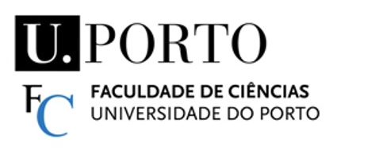

# <font size="80">Rush Hour</font>
*******
Trabalho realizado por:

* Álvaro Castro (FCUP_IACD:202405722)
* Bernardo Soeiro (FCUP_IACD:202406233) 
* Francisco Machado (FCUP_IACD:202403514)
<div style="padding: 10px;padding-left:5%">


</div>

<div style="clear:both;"></div>

******
### SOBRE O PROJETO 
No segundo semestre do primeiro ano da Licenciatura em Inteligência Artificial e Ciência de Dados, na Faculdade de Ciências da Universidade do Porto, fomos desafiados a desenvolver uma Inteligência Artificial capaz de jogar jogos de tabuleiro competitivos, neste caso, um jogo para dois jogadores. O objetivo deste projeto passa por explorar algoritmos de pesquisa adversária, nomeadamente Minimax, Alfa-Beta Cuts e Monte Carlo Tree Search (MCTS). Estes métodos são aplicados com diferentes configurações e níveis de profundidade, sendo avaliados em função do seu desempenho em diferentes situações de jogo. 

>Para aceder à documentação completa e formalização do problema, deve por favor abrir o ficheiro [Rush_Hour_Documentacao.docx](Rush_Hour_Documentacao.docx)

## Como fazer o download e utilizar a interface  
#### Primeiro passo:
Extraia o .zip da página github e descomprima o ficheiro
#### Segundo passo: 
Instale `numpy` no diretório pelo terminal 
```
pip install numpy
```
#### Terceiro passo: **IMPORTANTE** 
Entre no diretório do ficheiro main.py pelo terminal (no folder [/dameo main](/dameo_sub)) 
```
cd (diretório da pasta)
```
#### Quarto passo 
Corra o programa 
```
python3 rush_hour.py
```
*****

